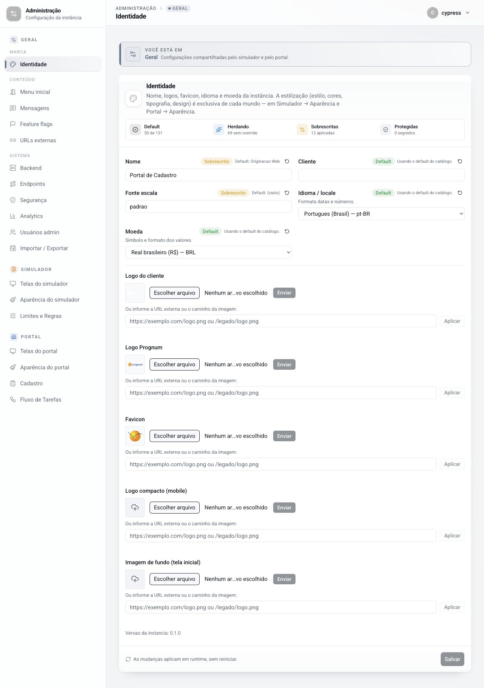
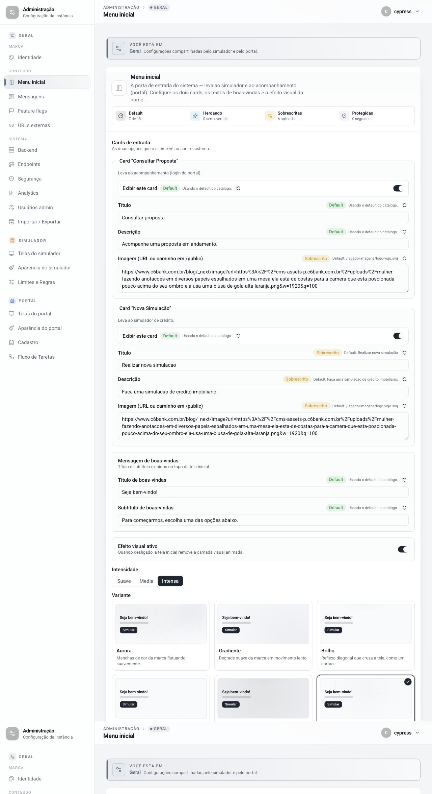
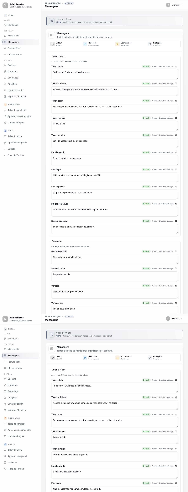
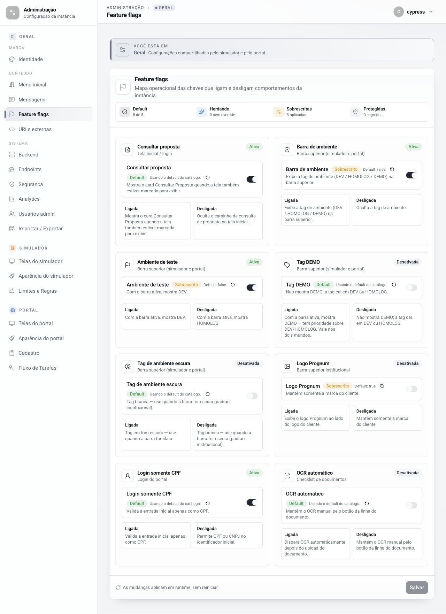
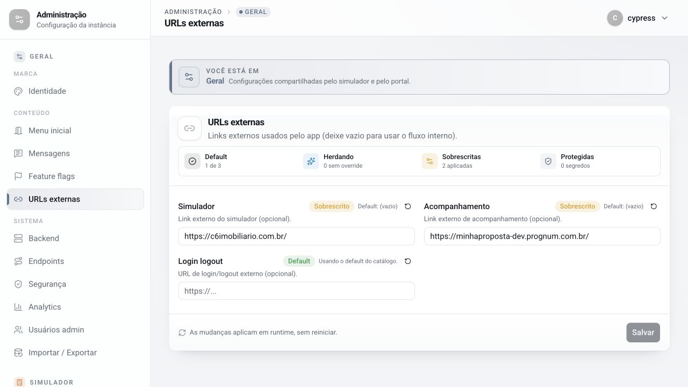
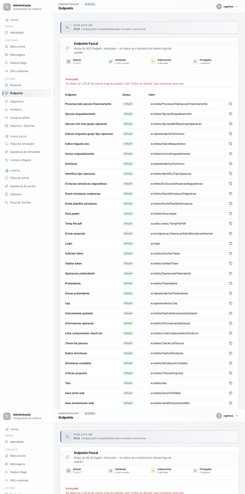

# Documentação técnica do painel administrativo

## 1. Controle do documento

| Item | Valor |
| --- | --- |
| Sistema | Minha Proposta — Portal de Cadastro |
| Ambiente analisado | DEV |
| URL base | `https://minhaproposta-dev.prognum.com.br/admin` |
| Data do levantamento | 03/07/2026 |
| Método | Inspeção funcional da interface autenticada e dos contratos expostos no DOM |
| Situação | Em elaboração, tela por tela |

### Convenção de evidência

- **Comprovado:** comportamento, valor ou contrato observado diretamente na interface.
- **A confirmar:** hipótese funcional que depende de alteração controlada, persistência ou acesso ao código-fonte do aplicativo.
- Credenciais, tokens e outros dados sensíveis não são registrados neste documento.

## 2. Visão geral do painel

### 2.1 Objetivo

O painel centraliza configurações da instância que são consumidas pelo simulador e pelo portal do cliente. A própria interface informa que as mudanças são aplicadas em runtime, sem rebuild ou reinicialização do aplicativo público.

### 2.2 Indicadores observados

| Indicador | Quantidade | Interpretação apresentada pela interface |
| --- | ---: | --- |
| Chaves carregadas | 424 | Total de configurações carregadas pela instância |
| Default | 305 | Configurações fornecidas pelo catálogo padrão |
| Herdando | 69 | Configurações sem override local |
| Sobrescritas | 50 | Configurações com valor específico da instância |
| Protegidas | 0 | Configurações tratadas como protegidas/segredos |

### 2.3 Previews disponíveis

| Preview | Destino |
| --- | --- |
| Início | Home pública (`/`) |
| Login | Portal do cliente (`/login`) |
| Simulador | Fluxo inicial (`/menu-simulacao`) |
| Detalhe | Exemplo do portal (`/preview-inst-detalhe`) |

### 2.4 Módulos

- **Geral:** Identidade, Menu inicial, Mensagens, Feature flags, URLs externas, Backend, Endpoints, Segurança, Analytics, Usuários admin e Importar/Exportar.
- **Simulador:** Telas do simulador, Aparência do simulador e Limites e Regras.
- **Portal:** Telas do portal, Aparência do portal, Cadastro e Fluxo de Tarefas.

## 3. Tela Identidade

### 3.1 Identificação

| Item | Valor |
| --- | --- |
| Menu | Geral > Marca > Identidade |
| Rota | `/admin/identidade` |
| Escopo informado | Configurações compartilhadas pelo simulador e pelo portal |
| Versão da instância | `0.1.0` |

### 3.2 Objetivo funcional

A tela configura o nome da instância, identificação do cliente, escala de fonte, idioma, moeda e ativos visuais compartilhados. Cores, tipografia, geometria e demais opções de aparência não pertencem a esta tela; são configuradas separadamente em **Simulador > Aparência** e **Portal > Aparência**.



### 3.3 Resumo de estado exibido na tela

| Estado | Quantidade | Complemento exibido |
| --- | ---: | --- |
| Default | 50 de 131 | Chaves usando o valor do catálogo |
| Herdando | 69 | Sem override |
| Sobrescritas | 12 | Aplicadas |
| Protegidas | 0 | Segredos |

Esses números correspondem ao recorte de configurações apresentado pela tela e diferem dos totais globais do painel.

### 3.4 Campos da instância

| Campo | Chave técnica exposta | Valor observado | Origem | Default informado | Efeito documentado pela interface |
| --- | --- | --- | --- | --- | --- |
| Nome | `instancia.nome` / `instancia__nome` | `Portal de Cadastro` | Sobrescrito | `Originacao Web` | Nome da instância |
| Cliente | `instancia.cliente` / `instancia__cliente` | Campo sem valor explícito | Default | Catálogo | Identificação do cliente |
| Fonte escala | `instancia.fonteEscala` / `instancia__fonteEscala` | `padrao` | Sobrescrito | Vazio | Escala tipográfica compartilhada |
| Idioma / locale | `instancia.locale` / `instancia__locale` | `pt-BR` | Default | Catálogo | Formatação de datas e números |
| Moeda | `instancia.moeda` / `instancia__moeda` | `BRL` | Default | Catálogo | Símbolo e formato dos valores |

Nenhum desses controles possui o atributo HTML `required` no estado analisado.

### 3.5 Valores permitidos

#### Idioma / locale

| Descrição | Valor técnico |
| --- | --- |
| Português (Brasil) | `pt-BR` |
| Português (Portugal) | `pt-PT` |
| Inglês (EUA) | `en-US` |
| Espanhol (Espanha) | `es-ES` |
| Espanhol (Argentina) | `es-AR` |

#### Moeda

| Descrição | Valor técnico |
| --- | --- |
| Real brasileiro (R$) | `BRL` |
| Dólar americano (US$) | `USD` |
| Euro (€) | `EUR` |
| Libra esterlina (£) | `GBP` |
| Peso argentino | `ARS` |
| Peso uruguaio | `UYU` |
| Guarani paraguaio | `PYG` |

### 3.6 Herança, sobrescrita e restauração

Cada campo da instância apresenta seu estado atual, podendo estar usando o valor **Default** ou um valor **Sobrescrito**. Também existe uma ação individual **Restaurar default**, identificada tecnicamente pelo nome da chave, por exemplo `Restaurar instancia.nome para o default`.

**Comprovado:** a ação de restauração está disponível para os cinco campos da instância.

**A confirmar:** se a restauração modifica apenas o formulário até o acionamento de **Salvar** ou se remove o override imediatamente. O teste não foi executado para evitar alteração da configuração DEV.

### 3.7 Ativos visuais

Cada ativo oferece dois meios de configuração:

1. Seleção de arquivo local e ação **Enviar**.
2. Preenchimento de URL externa ou caminho interno e ação **Aplicar**.

| Ativo | Formatos aceitos pelo seletor | Preview/configuração observada |
| --- | --- | --- |
| Logo do cliente | PNG, SVG e WebP | Imagem externa configurada e exibida no preview |
| Logo Prognum | PNG, SVG e WebP | `/legado/logo_prognum.png` |
| Favicon | ICO e PNG | `/legado/img/favicon.ico` |
| Logo compacto (mobile) | PNG, SVG e WebP | Nenhum preview detectado |
| Imagem de fundo (tela inicial) | JPEG, JPG, PNG e WebP | Nenhum preview detectado |

O campo de endereço aceita, conforme placeholder da interface:

- URL absoluta, por exemplo `https://exemplo.com/logo.png`;
- caminho interno, por exemplo `/legado/logo.png`.

### 3.8 Estados dos comandos

| Comando | Estado inicial observado | Condição comprovada na interface |
| --- | --- | --- |
| Enviar | Desabilitado | Permanece desabilitado sem arquivo selecionado |
| Aplicar | Desabilitado | Permanece desabilitado sem endereço preenchido |
| Salvar | Desabilitado | Permanece desabilitado sem alteração pendente |

### 3.9 Persistência e aplicação

- A tela apresenta um botão global **Salvar** para as configurações da instância.
- No carregamento inicial, o botão permanece desabilitado porque não existem alterações pendentes.
- A interface informa: **“As mudanças aplicam em runtime, sem reiniciar.”**
- **A confirmar:** se upload e aplicação de URL persistem imediatamente ou se também participam do salvamento global.

### 3.10 Validações e pontos ainda não comprovados

Os seguintes contratos não são informados pela interface e devem ser verificados em teste controlado ou no código-fonte do aplicativo:

- tamanho máximo de cada arquivo;
- dimensões e proporções recomendadas;
- validação de conteúdo além da extensão/MIME apresentada pelo seletor;
- tratamento de URL inválida, indisponível ou sem permissão pública;
- mensagens de sucesso e erro de upload;
- efeito exato de cada ativo no simulador e no portal;
- comportamento diante de nome, cliente ou escala de fonte vazios;
- persistência e rollback após falha de salvamento.

### 3.11 Critérios mínimos para teste funcional futuro

1. Alterar cada campo textual e confirmar a habilitação de **Salvar**.
2. Salvar, recarregar a página e validar a persistência.
3. Restaurar um campo sobrescrito e confirmar a remoção do override.
4. Validar todos os locales e moedas no portal público.
5. Enviar um arquivo válido de cada tipo suportado e conferir o preview.
6. Rejeitar arquivos com formato, tamanho ou conteúdo inválido.
7. Aplicar URL absoluta e caminho interno válidos.
8. Validar mensagens para URL inválida e ativo inacessível.
9. Confirmar a propagação em runtime nos previews públicos.

## 4. Tela Menu inicial

### 4.1 Identificação

| Item | Valor |
| --- | --- |
| Menu | Geral > Conteúdo > Menu inicial |
| Rota administrativa | `/admin/tela-inicial` |
| Rota pública afetada | `/` |
| Escopo informado | Porta de entrada para o simulador e para o acompanhamento da proposta |

### 4.2 Objetivo funcional

A tela configura os dois cards apresentados na home pública, a mensagem de boas-vindas e a camada visual animada. Cada card pode ser exibido ou ocultado e possui título, descrição e imagem próprios.



### 4.3 Resumo de estado exibido na tela

| Estado | Quantidade | Complemento exibido |
| --- | ---: | --- |
| Default | 7 de 13 | Chaves usando o valor do catálogo |
| Herdando | 0 | Sem override |
| Sobrescritas | 6 | Aplicadas |
| Protegidas | 0 | Segredos |

### 4.4 Card “Consultar Proposta”

O card direciona o usuário ao acompanhamento da proposta, identificado na interface como login do portal.

| Campo | Chave técnica exposta | Valor observado | Origem | Default informado |
| --- | --- | --- | --- | --- |
| Exibir este card | `telas.menuInicial.cards.consultarProposta.exibir` / `telas__menuInicial__cards__consultarProposta__exibir` | Ativo | Default | Catálogo |
| Título | `telas.menuInicial.cards.consultarProposta.titulo` / `telas__menuInicial__cards__consultarProposta__titulo` | `Consultar proposta` | Default | Catálogo |
| Descrição | `telas.menuInicial.cards.consultarProposta.descricao` / `telas__menuInicial__cards__consultarProposta__descricao` | `Acompanhe uma proposta em andamento.` | Default | Catálogo |
| Imagem | `telas.menuInicial.cards.consultarProposta.imagem` / `telas__menuInicial__cards__consultarProposta__imagem` | URL externa do C6 Bank | Sobrescrito | `/legado/imagens/logo-vojo.svg` |

### 4.5 Card “Nova Simulação”

O card direciona o usuário ao simulador de crédito.

| Campo | Chave técnica exposta | Valor observado | Origem | Default informado |
| --- | --- | --- | --- | --- |
| Exibir este card | `telas.menuInicial.cards.novaSimulacao.exibir` / `telas__menuInicial__cards__novaSimulacao__exibir` | Ativo | Default | Catálogo |
| Título | `telas.menuInicial.cards.novaSimulacao.titulo` / `telas__menuInicial__cards__novaSimulacao__titulo` | `Realizar nova simulacao` | Sobrescrito | `Realizar nova simulação` |
| Descrição | `telas.menuInicial.cards.novaSimulacao.descricao` / `telas__menuInicial__cards__novaSimulacao__descricao` | `Faca uma simulacao de credito imobiliario.` | Sobrescrito | `Faça uma simulação de crédito imobiliário.` |
| Imagem | `telas.menuInicial.cards.novaSimulacao.imagem` / `telas__menuInicial__cards__novaSimulacao__imagem` | URL externa do C6 Bank | Sobrescrito | `/legado/imagens/logo-vojo.svg` |

Os valores sobrescritos de título e descrição estão sem acentuação no ambiente analisado. A interface pública reproduz esses valores exatamente como foram configurados.

### 4.6 Imagens dos cards

- O campo é uma área de texto identificada como **Imagem (URL ou caminho em `/public`)**.
- Os dois cards utilizam a mesma URL externa no estado analisado.
- A mesma imagem foi comprovadamente carregada nos dois cards da home pública.
- A tela não apresenta seletor de arquivo para esses cards; o administrador informa o endereço do recurso.
- Não foram observados atributos HTML de obrigatoriedade, limite de caracteres ou padrão de URL.

### 4.7 Mensagem de boas-vindas

| Campo | Chave técnica exposta | Valor observado | Origem |
| --- | --- | --- | --- |
| Título de boas-vindas | `telas.menuInicial.tituloBemVindo` / `telas__menuInicial__tituloBemVindo` | `Seja bem-vindo!` | Default |
| Subtítulo de boas-vindas | `telas.menuInicial.descBemVindo` / `telas__menuInicial__descBemVindo` | `Para começarmos, escolha uma das opções abaixo.` | Default |

Os dois textos foram confirmados no topo da home pública.

### 4.8 Efeito visual da home

| Configuração | Estado observado | Contrato visível |
| --- | --- | --- |
| Efeito visual ativo | Ligado | Quando desligado, remove a camada visual animada da tela inicial |
| Intensidade | Intensa | Permite escolher Suave, Média ou Intensa |
| Variante | Malha viva (`malha`) | Grade discreta com brilho pulsante |

A chave técnica exposta para a variante é `telas__menuInicial__efeito__variante`. As chaves completas de ativação e intensidade não foram expostas no DOM analisado e, por isso, não são presumidas neste documento.

#### Variantes disponíveis

| Variante | Valor técnico | Descrição exibida |
| --- | --- | --- |
| Aurora | `aurora` | Manchas de cor da marca flutuando suavemente |
| Gradiente | `gradiente` | Degradê suave da marca em movimento lento |
| Brilho | `brilho` | Reflexo diagonal que cruza a tela, como um cartão |
| Halo | `halo` | Anéis concêntricos sutis, em respiro |
| Holofote | `holofote` | Brilho que acompanha o cursor do mouse |
| Malha viva | `malha` | Grade discreta com brilho pulsante |

Cada variante possui uma miniatura de simulação dentro do painel. A interface destaca que **Holofote** acompanha o cursor apenas na tela real.

### 4.9 Herança e restauração

Os campos dos dois cards e da mensagem de boas-vindas possuem ação individual **Restaurar default**. O nome acessível dessa ação contém a chave técnica correspondente, permitindo relacionar cada controle à configuração persistida.

**Comprovado:** os controles mostram se o valor atual é Default ou Sobrescrito e informam o default quando existe override.

**A confirmar:** se a restauração altera somente o formulário até **Salvar** ou remove o override imediatamente. A ação não foi executada para preservar o ambiente DEV.

### 4.10 Persistência e aplicação

- Existe um único formulário administrativo na tela.
- O botão global **Salvar** inicia desabilitado quando não há alterações pendentes.
- A interface informa que as mudanças são aplicadas em runtime, sem reinicialização.
- Nenhuma alteração foi submetida durante este levantamento.

### 4.11 Impacto comprovado na home pública

Foi realizada uma leitura não destrutiva da rota pública `/`. O resultado confirmou:

- título e subtítulo de boas-vindas;
- exibição dos dois cards;
- títulos e descrições exatamente iguais aos valores do admin;
- utilização da mesma URL de imagem nos dois cards.

O destino acionado por cada card não foi executado nesta etapa. A associação **Consultar proposta → portal** e **Nova Simulação → simulador** está comprovada pela descrição funcional do próprio painel, mas o comportamento de navegação ainda deve ser validado por clique.

### 4.12 Validações e pontos ainda não comprovados

- comportamento quando os dois cards são desativados;
- obrigatoriedade e limite de tamanho para títulos e descrições;
- validação e fallback de imagem inválida ou indisponível;
- tratamento de protocolo, domínio e caminho local informados na imagem;
- acessibilidade/`alt` das imagens, que não apresentou texto alternativo na home analisada;
- persistência individual dos controles de efeito;
- diferença visual efetiva entre as três intensidades;
- desempenho e comportamento responsivo das seis variantes;
- respeito à preferência de redução de movimento do navegador;
- destino e regra de navegação de cada card.

### 4.13 Critérios mínimos para teste funcional futuro

1. Desativar cada card isoladamente e confirmar sua remoção na home.
2. Desativar os dois cards e validar o estado vazio da tela.
3. Alterar título, descrição e imagem, salvar e recarregar.
4. Restaurar cada campo e confirmar a remoção do override.
5. Validar URL externa, caminho em `/public`, URL inválida e imagem indisponível.
6. Confirmar o destino de navegação dos dois cards.
7. Desativar o efeito visual e confirmar a remoção da camada animada.
8. Validar as intensidades Suave, Média e Intensa.
9. Validar as seis variantes em desktop e mobile.
10. Confirmar atualização da home pública sem rebuild ou reinicialização.

## 5. Tela Mensagens

### 5.1 Identificação

| Item | Valor |
| --- | --- |
| Menu | Geral > Conteúdo > Mensagens |
| Rota | `/admin/mensagens` |
| Escopo informado | Textos apresentados ao cliente final, organizados por contexto |
| Quantidade de mensagens | 22 |

### 5.2 Objetivo funcional

A tela centraliza textos transacionais e de orientação utilizados nos fluxos de autenticação, consulta de propostas, envio de documentos e processamento. Todos os controles são áreas de texto, permitindo editar o conteúdo sem alteração do código da aplicação.



### 5.3 Resumo de estado exibido na tela

| Estado | Quantidade | Complemento exibido |
| --- | ---: | --- |
| Default | 22 de 22 | Todas as mensagens usam o catálogo |
| Herdando | 0 | Sem override |
| Sobrescritas | 0 | Nenhuma aplicada |
| Protegidas | 0 | Segredos |

No ambiente analisado, não existe nenhuma mensagem sobrescrita pela instância.

### 5.4 Login e token

O grupo é descrito como responsável pelo acesso por CPF, envio e validação do token.

| Campo | Chave técnica | Valor atual/default | Finalidade indicada |
| --- | --- | --- | --- |
| Token título | `mensagens.tokenTitulo` / `mensagens__tokenTitulo` | `Tudo certo! Enviamos o link de acesso.` | Título após envio do link |
| Token subtítulo | `mensagens.tokenSubtitulo` / `mensagens__tokenSubtitulo` | `Acesse o link que enviamos para o seu e-mail para entrar no portal.` | Orientação para acessar o e-mail |
| Token spam | `mensagens.tokenSpam` / `mensagens__tokenSpam` | `Se nao aparecer na caixa de entrada, verifique o spam ou lixo eletronico.` | Orientação sobre spam/lixo eletrônico |
| Token reenvio | `mensagens.tokenReenvio` / `mensagens__tokenReenvio` | `Reenviar link` | Rótulo da ação de reenvio |
| Token inválido | `mensagens.tokenInvalido` / `mensagens__tokenInvalido` | `Link de acesso invalido ou expirado.` | Erro de link inválido ou expirado |
| E-mail enviado | `mensagens.emailEnviado` / `mensagens__emailEnviado` | `E-mail enviado com sucesso.` | Confirmação de envio |
| Erro login | `mensagens.erroLogin` / `mensagens__erroLogin` | `Não localizamos nenhuma simulação nesse CPF.` | Ausência de simulação para o CPF |
| Erro login link | `mensagens.erroLoginLink` / `mensagens__erroLoginLink` | `Clique aqui para realizar uma simulação` | Chamada para iniciar simulação |
| Muitas tentativas | `mensagens.muitasTentativas` / `mensagens__muitasTentativas` | `Muitas tentativas. Tente novamente em alguns minutos.` | Bloqueio temporário/rate limit |
| Sessão expirada | `mensagens.sessaoExpirada` / `mensagens__sessaoExpirada` | `Sua sessao expirou. Faca login novamente.` | Nova autenticação após expiração |

### 5.5 Propostas

O grupo reúne mensagens de consulta, status e prazo das propostas.

| Campo | Chave técnica | Valor atual/default | Finalidade indicada |
| --- | --- | --- | --- |
| Não encontrado | `mensagens.naoEncontrado` / `mensagens__naoEncontrado` | `Nenhuma proposta localizada.` | Resultado vazio da consulta |
| Vencida título | `mensagens.vencidaTitulo` / `mensagens__vencidaTitulo` | `Proposta vencida` | Título do aviso/modal de vencimento |
| Vencida | `mensagens.vencida` / `mensagens__vencida` | `O prazo desta proposta expirou.` | Corpo do aviso de vencimento |
| Vencida botão | `mensagens.vencidaBtn` / `mensagens__vencidaBtn` | `Iniciar nova simulacao` | Ação oferecida após vencimento |
| Recusada título | `mensagens.recusadaTitulo` / `mensagens__recusadaTitulo` | `Proposta recusada` | Título do aviso de recusa |
| Recusada | `mensagens.recusada` / `mensagens__recusada` | `Esta proposta foi recusada e nao podera ser retomada.` | Corpo do aviso de recusa |
| Recusada botão | `mensagens.recusadaBtn` / `mensagens__recusadaBtn` | `Voltar ao inicio` | Ação oferecida após recusa |
| Prazo cadastro | `mensagens.prazoCadastro` / `mensagens__prazoCadastro` | `Voce tem 30 dias para concluir o cadastro.` | Prazo informado ao cliente |

O uso de `mensagens.vencidaTitulo` foi confirmado em evidência funcional existente: ao abrir uma proposta vencida, o portal apresentou o modal **Proposta vencida**. Os demais pontos de exibição foram classificados pela descrição do painel e pelas próprias chaves, mas ainda precisam de execução dirigida.

### 5.6 Upload e processamento

| Campo | Chave técnica | Valor atual/default | Finalidade indicada |
| --- | --- | --- | --- |
| Wait | `mensagens.wait` / `mensagens__wait` | `Processando, aguarde...` | Estado de espera/processamento |
| Upload inválido | `mensagens.uploadInvalido` / `mensagens__uploadInvalido` | `Arquivo invalido ou nao suportado.` | Arquivo incompatível |
| Upload tamanho | `mensagens.uploadTamanho` / `mensagens__uploadTamanho` | `O arquivo excede o tamanho maximo permitido.` | Arquivo acima do limite |
| Ajuda | `mensagens.enviarDocs.ajuda` / `mensagens__enviarDocs__ajuda` | `Solicitamos alguns documentos para dar andamento a sua proposta. Se nao tiver todos disponiveis agora, sem problema: voce pode continuar e enviar os documentos restantes em outro momento.` | Texto do modal de ajuda do envio de documentos |

### 5.7 Contratos dos campos

- Os 22 campos são elementos HTML `textarea`.
- Nenhum campo apresenta `required`, `minlength`, `maxlength` ou placeholder no estado analisado.
- Cada mensagem possui uma ação individual **Restaurar default**, vinculada à sua chave técnica.
- Como todos os valores já estão em Default, as ações de restauração não foram executadas.
- O botão global **Salvar** inicia desabilitado quando não existem alterações pendentes.

**A confirmar:** preservação de quebras de linha, tratamento de texto vazio, limite aplicado no backend e sanitização de HTML/caracteres especiais.

### 5.8 Aplicação em runtime

A interface informa que as mudanças são aplicadas em runtime, sem reinicialização. O comportamento esperado é que o novo texto passe a ser usado no próximo acionamento do contexto correspondente.

**A confirmar:** se sessões ou páginas já abertas recebem o novo conteúdo imediatamente ou apenas após nova navegação/recarregamento.

### 5.9 Qualidade textual observada

Parte dos valores default utiliza acentuação, enquanto outra parte apresenta palavras sem sinais diacríticos, por exemplo:

- `nao`, `eletronico`, `invalido` e `sessao`;
- `simulacao`, `podera` e `inicio`;
- `Voce`, `Faca` e `maximo`.

A diferença é reproduzida neste documento exatamente como aparece na configuração. Recomenda-se revisão editorial antes de considerar esses textos definitivos para produção.

### 5.10 Validações e pontos ainda não comprovados

- local exato de exibição de cada mensagem;
- componente visual utilizado: modal, alerta, toast, texto de apoio ou botão;
- suporte a múltiplas linhas e caracteres especiais;
- comportamento quando uma mensagem é salva vazia;
- limite real de caracteres aceito pelo backend;
- escape/sanitização contra conteúdo HTML ou script;
- atualização de texto em sessões já abertas;
- relação entre `tokenTitulo`, `emailEnviado` e os diferentes estados do envio;
- destino das ações `erroLoginLink`, `vencidaBtn` e `recusadaBtn`;
- se o prazo textual de 30 dias acompanha uma regra configurável ou é apenas conteúdo estático.

### 5.11 Critérios mínimos para teste funcional futuro

1. Alterar uma mensagem de cada grupo, salvar e confirmar sua exibição no fluxo correspondente.
2. Recarregar o admin e validar a persistência e o estado Sobrescrito.
3. Restaurar a mensagem e confirmar retorno ao catálogo padrão.
4. Validar CPF sem simulação, token inválido, token expirado e excesso de tentativas.
5. Validar proposta inexistente, vencida e recusada, incluindo os botões de ação.
6. Validar upload inválido, arquivo acima do limite e modal de ajuda.
7. Testar conteúdo vazio, múltiplas linhas, acentos, símbolos e tamanho elevado.
8. Confirmar sanitização de HTML/script e renderização como texto seguro.
9. Revisar ortografia e acentuação de todos os textos padrão.
10. Confirmar aplicação em runtime sem rebuild ou reinicialização.

## 6. Tela Feature flags

### 6.1 Identificação

| Item | Valor |
| --- | --- |
| Menu | Geral > Conteúdo > Feature flags |
| Rota | `/admin/flags` |
| Escopo informado | Mapa operacional das chaves que ligam e desligam comportamentos da instância |
| Quantidade de flags | 8 |

### 6.2 Objetivo funcional

A tela permite ativar ou desativar comportamentos do simulador e do portal sem alteração de código. Cada flag apresenta o estado atual, sua origem, o comportamento quando ligada e o comportamento quando desligada.



### 6.3 Resumo de estado exibido na tela

| Estado | Quantidade | Complemento exibido |
| --- | ---: | --- |
| Default | 5 de 8 | Flags usando o catálogo |
| Herdando | 0 | Sem override |
| Sobrescritas | 3 | Aplicadas |
| Protegidas | 0 | Segredos |

### 6.4 Mapa das flags

| Flag | Chave técnica | Estado atual | Origem/default | Escopo |
| --- | --- | --- | --- | --- |
| Consultar proposta | `flags.consultarOperacao` / `flags__consultarOperacao` | Ativa | Default | Tela inicial/login |
| Barra de ambiente | `flags.showBarraAmbiente` / `flags__showBarraAmbiente` | Ativa | Sobrescrito; default `false` | Barra superior do simulador e portal |
| Ambiente de teste | `flags.ambienteTeste` / `flags__ambienteTeste` | Ativa | Sobrescrito; default `false` | Barra superior do simulador e portal |
| Tag DEMO | `flags.ambienteDemo` / `flags__ambienteDemo` | Desativada | Default | Barra superior do simulador e portal |
| Tag de ambiente escura | `flags.ambienteTagEscura` / `flags__ambienteTagEscura` | Desativada | Default | Barra superior do simulador e portal |
| Logo Prognum | `flags.showLogoPrognum` / `flags__showLogoPrognum` | Desativada | Sobrescrito; default `true` | Barra superior institucional |
| Login somente CPF | `flags.loginSoCpf` / `flags__loginSoCpf` | Ativa | Default | Login do portal |
| OCR automático | `flags.ocrAutomatico` / `flags__ocrAutomatico` | Desativada | Default | Checklist de documentos |

### 6.5 Consultar proposta

Quando ligada, a flag permite exibir o card **Consultar Proposta** na tela inicial. A própria tela informa uma dependência adicional: o card também precisa estar marcado para exibição em **Menu inicial**.

O comportamento efetivo é, portanto, uma combinação de duas configurações:

```text
flags.consultarOperacao = true
E telas.menuInicial.cards.consultarProposta.exibir = true
→ card Consultar Proposta visível
```

No estado atual, as duas configurações estão ativas e o card foi confirmado na home pública.

### 6.6 Barra e identificação do ambiente

As quatro flags abaixo trabalham em conjunto:

| Condição | Resultado informado |
| --- | --- |
| `showBarraAmbiente = false` | Oculta a tag de ambiente |
| Barra ativa + `ambienteDemo = true` | Exibe `DEMO`, com prioridade sobre DEV/HOMOLOG |
| Barra ativa + DEMO desligada + `ambienteTeste = true` | Exibe `DEV` |
| Barra ativa + DEMO desligada + `ambienteTeste = false` | Exibe `HOMOLOG` |
| `ambienteTagEscura = true` | Usa tag em tom escuro, indicada para barra clara |
| `ambienteTagEscura = false` | Usa tag branca, indicada para barra escura |

No ambiente analisado, a home pública exibiu a tag **DEV**, coerente com a barra ativa, a flag de teste ligada e a flag DEMO desligada.

### 6.7 Logo Prognum

- **Ligada:** exibe o logo Prognum ao lado do logo do cliente.
- **Desligada:** mantém somente a marca do cliente.

A flag está sobrescrita como `false`, embora seu default seja `true`. Na home pública foi encontrada apenas a imagem institucional do cliente; o logo Prognum não estava presente.

### 6.8 Login somente CPF

- **Ligada:** valida a entrada inicial apenas como CPF.
- **Desligada:** permite CPF ou CNPJ como identificador inicial.

A flag está ativa. A rota pública `/login` apresentou:

- instrução **Informe o seu CPF**;
- rótulo **CPF**;
- máscara/placeholder `000.000.000-00`.

O campo mantém internamente o nome `cpfCnpj`, mas a interface e a máscara atuais são exclusivamente de CPF. A razão dessa nomenclatura interna não foi confirmada.

### 6.9 OCR automático

- **Ligada:** dispara o OCR automaticamente após o upload de um documento.
- **Desligada:** mantém o processamento manual pelo botão da linha do documento.

A flag está desativada. O comportamento no checklist autenticado não foi executado nesta etapa, portanto a existência e o funcionamento do botão manual ainda devem ser validados diretamente no fluxo.

### 6.10 Herança, restauração e persistência

- Todas as flags são controles booleanos apresentados como switches.
- Cada flag possui ação individual **Restaurar default** vinculada à chave técnica.
- O botão global **Salvar** inicia desabilitado sem alterações pendentes.
- A interface informa que as mudanças são aplicadas em runtime, sem reinicialização.
- Nenhuma flag foi alterada durante o levantamento.

### 6.11 Impactos comprovados no aplicativo público

| Evidência | Resultado |
| --- | --- |
| Card Consultar Proposta | Visível na home |
| Tag de ambiente | `DEV` visível |
| Logo Prognum | Não exibido; somente logo do cliente |
| Login | Interface e máscara exclusivas de CPF |

### 6.12 Riscos operacionais e pontos ainda não comprovados

- comportamento da home quando a flag de consulta e a configuração do card divergem;
- atualização das flags em páginas e sessões já abertas;
- precedência quando DEMO e ambiente de teste estão simultaneamente ativos;
- contraste real da tag clara/escura em todos os temas;
- consistência da barra de ambiente no simulador e no portal autenticado;
- aceitação ou rejeição efetiva de CNPJ com `loginSoCpf` ligado e desligado;
- momento exato do disparo do OCR automático;
- tratamento de falha, repetição ou concorrência do OCR;
- autorização necessária para mudar flags com impacto operacional;
- existência de auditoria, histórico ou rollback das alterações.

### 6.13 Critérios mínimos para teste funcional futuro

1. Validar as quatro combinações entre a flag de consulta e a exibição do card.
2. Desativar a barra e confirmar sua remoção nos dois mundos.
3. Validar DEV, HOMOLOG e DEMO, incluindo a precedência de DEMO.
4. Validar contraste da tag clara e escura em cada tema disponível.
5. Ativar e desativar o logo Prognum e conferir desktop/mobile.
6. Validar CPF e CNPJ com `loginSoCpf` nos dois estados.
7. Comparar OCR manual e automático com arquivo válido e inválido.
8. Confirmar persistência, restauração do default e atualização em runtime.
9. Verificar sessões abertas durante a mudança de cada flag.
10. Confirmar trilha de auditoria e estratégia de rollback.

## 7. Tela URLs externas

### 7.1 Identificação

| Item | Valor |
| --- | --- |
| Menu | Geral > Conteúdo > URLs externas |
| Rota | `/admin/urls` |
| Escopo informado | Links externos usados pelo aplicativo |
| Quantidade de destinos | 3 |

### 7.2 Objetivo funcional

A tela permite substituir fluxos internos por endereços configuráveis para simulador, acompanhamento e login/logout. O contrato funcional apresentado pelo painel é: **deixar o campo vazio mantém o fluxo interno**.



### 7.3 Resumo de estado exibido na tela

| Estado | Quantidade | Complemento exibido |
| --- | ---: | --- |
| Default | 1 de 3 | Um destino usa o catálogo |
| Herdando | 0 | Sem override |
| Sobrescritas | 2 | Aplicadas |
| Protegidas | 0 | Segredos |

### 7.4 Mapa dos destinos

| Campo | Chave técnica | Valor observado | Origem/default | Finalidade declarada |
| --- | --- | --- | --- | --- |
| Simulador | `urls.simulador` / `urls__simulador` | `https://c6imobiliario.com.br/` | Sobrescrito; default vazio | Link externo do simulador |
| Acompanhamento | `urls.acompanhamento` / `urls__acompanhamento` | `https://minhaproposta-dev.prognum.com.br/` | Sobrescrito; default vazio | Link externo de acompanhamento |
| Login logout | `urls.loginLogout` / `urls__loginLogout` | Vazio | Default | URL externa de login/logout |

Embora seja classificado como externo, o destino atual de **Acompanhamento** aponta para a raiz da própria instância DEV.

### 7.5 Regra de fallback

Os três destinos são opcionais. De acordo com o texto da tela:

```text
URL preenchida → usa o destino configurado
URL vazia      → usa o fluxo interno da aplicação
```

**A confirmar:** quais rotas internas são utilizadas por cada campo quando vazio e se todos os pontos de navegação consomem a mesma chave.

### 7.6 Contratos dos campos

- Os três controles são elementos HTML `input` de texto, não `input type="url"`.
- O placeholder é `https://...`.
- Não existem atributos HTML `required`, `pattern`, `minlength` ou `maxlength` no estado analisado.
- Cada campo possui ação individual **Restaurar default**.
- O botão global **Salvar** inicia desabilitado sem alterações pendentes.
- As duas URLs preenchidas usam HTTPS e terminam com `/`.

O placeholder orienta o uso de HTTPS, mas não comprova uma validação técnica de protocolo, domínio ou formato no backend.

### 7.7 Relação com os fluxos conhecidos

- **Simulador:** destinado a navegações que levam o cliente a iniciar ou refazer uma simulação.
- **Acompanhamento:** destinado ao acesso ao fluxo de acompanhamento/portal.
- **Login logout:** destinado a substituir a entrada ou saída padrão por um fluxo externo.

Existe evidência automatizada anterior, registrada em 29/06/2026, de que o botão **Fazer simulação com outro imóvel** redirecionava internamente para `/menu-simulacao`, apesar da regra esperar `https://c6imobiliario.com.br`. Essa evidência não foi revalidada nesta etapa e indica que nem todo consumidor necessariamente utiliza `urls.simulador` de forma uniforme.

### 7.8 Aplicação em runtime

A interface informa que as mudanças são aplicadas em runtime, sem reinicialização. Nenhuma URL foi alterada ou acionada durante este levantamento.

**A confirmar:** se páginas ou sessões já abertas passam a usar o novo endereço imediatamente e se existe cache dessas configurações no cliente.

### 7.9 Riscos de segurança e operação

- redirecionamento aberto para domínio não autorizado;
- aceitação de protocolos inseguros ou executáveis, como HTTP ou `javascript:`;
- erro de digitação que torne um fluxo essencial inacessível;
- destino externo indisponível, expirado ou sem HTTPS válido;
- perda de parâmetros necessários ao acompanhamento ou login;
- loop de redirecionamento quando o destino aponta novamente para a origem;
- inconsistência entre links que usam a configuração e links codificados diretamente;
- comportamento de abertura na mesma aba ou em nova aba;
- ausência de confirmação antes de abandonar um formulário com dados não salvos;
- exposição de tokens ou identificadores em query string ao navegar para terceiros.

### 7.10 Pontos ainda não comprovados

- validação de sintaxe e protocolo ao salvar;
- allowlist de domínios permitidos;
- normalização da barra final `/`;
- tratamento de URL relativa;
- preservação ou descarte de query string e fragmento;
- parâmetros acrescentados automaticamente pela aplicação;
- destino interno correspondente a cada campo vazio;
- todos os componentes consumidores de cada chave;
- mensagem e fallback quando o destino está indisponível;
- auditoria, versionamento e rollback das alterações.

### 7.11 Critérios mínimos para teste funcional futuro

1. Validar o fluxo interno com cada campo vazio.
2. Validar uma URL HTTPS permitida em cada campo.
3. Testar HTTP, URL relativa, domínio não autorizado e protocolos inválidos.
4. Confirmar o destino de todos os botões de iniciar/refazer simulação.
5. Confirmar todos os pontos de entrada do acompanhamento.
6. Validar login e logout com destino interno e externo.
7. Testar query string, fragmento, barra final e caracteres especiais.
8. Validar indisponibilidade, timeout e certificado inválido do destino.
9. Verificar vazamento de tokens ou dados pessoais para domínios externos.
10. Confirmar aplicação em runtime, auditoria e rollback.

## 8. Tela Backend

### 8.1 Identificação

| Item | Valor |
| --- | --- |
| Menu | Geral > Sistema > Backend |
| Rota | `/admin/pascal` |
| Escopo informado | Conexão e credenciais de integração com AEJS/Pascal |
| Organização | Comum, Portal e Simulador |

### 8.2 Tratamento de informações sensíveis

Esta tela contém endpoints, usuários técnicos, senhas, session keys e ferramentas que podem enviar OTP/e-mail real. Por segurança:

- nenhum valor sensível foi copiado para esta documentação;
- nenhuma conexão ou entrada de cliente foi testada;
- nenhum magic link foi gerado;
- nenhum OTP foi enviado;
- a evidência visual integral foi omitida para não registrar endpoints ou identificadores técnicos.

### 8.3 Objetivo funcional

A tela configura a comunicação do portal e do simulador com o backend legado AEJS/Pascal. As configurações comuns são compartilhadas, enquanto credenciais, ambiente e determinados parâmetros podem ser específicos de cada mundo.

### 8.4 Resumo de estado exibido na tela

| Estado | Quantidade | Complemento exibido |
| --- | ---: | --- |
| Default | 9 de 19 | Configurações usando o catálogo |
| Herdando | 0 | Sem override |
| Sobrescritas | 10 | Aplicadas |
| Protegidas | 0 | Segredos |

Cinco campos são individualmente identificados como **Protegido**, embora o resumo apresente `0 segredos`. A interface também informa que os valores ficam cifrados no servidor e nunca são exibidos integralmente. **A confirmar:** se o indicador `0` representa segredos expostos, overrides protegidos ou outra métrica.

### 8.5 Configurações comuns ao Portal e Simulador

| Campo | Chave técnica | Estado observado | Finalidade |
| --- | --- | --- | --- |
| Base URL | `pascal.baseUrl` / `pascal__baseUrl` | Configurada e sobrescrita | Endpoint principal do AEJS/Pascal usado por todos os fluxos |
| Base URL alternativa | `pascal.baseUrlAlternativa` / `pascal__baseUrlAlternativa` | Default e vazia | Fallback quando a URL principal estiver vazia |
| Criptografa | `pascal.criptografa` / `pascal__criptografa` | Ativa e sobrescrita; default `false` | Habilita transporte cifrado em AES legado |

A interface orienta habilitar a criptografia somente quando o ambiente de backend exigir.

### 8.6 Portal — ambiente e contexto

| Campo | Chave técnica | Estado observado | Finalidade |
| --- | --- | --- | --- |
| Ambiente operacional | `pascal.ambienteOperacional` / `pascal__ambienteOperacional` | Configurado e sobrescrito | Ambiente legado enviado às rotinas do portal e usado como default geral |
| Contexto | `pascal.contexto` / `pascal__contexto` | Default configurado | Contexto padrão das chamadas do portal |

O simulador possui ambiente próprio. Quando esse valor específico está vazio, o simulador herda `pascal.ambienteOperacional`.

### 8.7 Portal — login do cliente

| Campo | Chave técnica | Proteção | Finalidade |
| --- | --- | --- | --- |
| Usuário portal | `pascal.usuarioPortal` / `pascal__usuarioPortal` | Valor comum em default | Identidade técnica usada nas chamadas após o login do cliente |
| Login password | `pascal.loginPassword` / `pascal__loginPassword` | Protegido; `input type="password"` | Senha de integração enviada no login do portal |

O campo de senha carrega vazio e apresenta somente indicação mascarada do valor existente. A orientação é preencher apenas para substituí-lo; vazio preserva o comportamento padrão do ambiente.

### 8.8 Portal — integração técnica

| Campo | Chave técnica | Proteção | Finalidade |
| --- | --- | --- | --- |
| User name | `pascal.integracao.userName` / `pascal__integracao__userName` | Protegido | Usuário para domínios, combos e documentos server-side |
| Session key | `pascal.integracao.sessionKey` / `pascal__integracao__sessionKey` | Protegido | Sessão técnica estática para domínios e documentos |

A session key não passa pelo fluxo `w/login`. Os campos protegidos não carregam o segredo no valor do input e só devem ser preenchidos para troca.

A ação **Testar conexão (portal)** está disponível, mas não foi executada para evitar chamadas ao backend com credenciais reais.

### 8.9 Portal — documentos e tarefas

| Campo | Chave técnica | Estado observado | Finalidade |
| --- | --- | --- | --- |
| Tarefa padrão envio documentos | `pascal.tarefaPadraoEnvioDocumentos` / `pascal__tarefaPadraoEnvioDocumentos` | Default e vazio | Campo reservado para início da tarefa legada |
| Status tarefa envio documentos | `pascal.statusTarefaEnvioDocumentos` / `pascal__statusTarefaEnvioDocumentos` | Default e vazio | Campo reservado para status da tarefa legada |

Os dois campos são explicitamente descritos como reservados e aguardando confirmação dos códigos legados.

### 8.10 Diagnóstico de entrada do portal

A seção **Testar entrada do portal** simula o login por CPF/CNPJ usando o mesmo caminho funcional do portal e informa em qual etapa ocorre uma falha.

| Controle | Estado/contrato observado |
| --- | --- |
| CPF/CNPJ do cliente | Campo vazio, placeholder `Somente números` |
| Testar entrada do portal | Desabilitado sem identificador preenchido |
| Enviar OTP de verdade | Desligado por padrão |

- Com OTP desligado, o teste limita-se a login e consulta de propostas.
- Com OTP ligado, a interface alerta que um código **real** será enviado ao cliente.
- O CPF/CNPJ deve ser de teste e aparece mascarado no diagnóstico.
- A session key nunca é exibida.

### 8.11 Geração de link de acesso

A seção gera um magic link para entrar no portal sem que o cliente solicite o acesso.

| Controle | Estado/contrato observado |
| --- | --- |
| CPF/CNPJ para o link | Campo vazio, placeholder `Somente números` |
| Gerar link | Desabilitado sem identificador preenchido |

A interface alerta que a operação dispara e-mail real para o cliente. Por isso, nenhum link foi gerado neste levantamento.

### 8.12 Simulador — credenciais e ambiente

| Campo | Chave técnica | Estado/proteção | Finalidade |
| --- | --- | --- | --- |
| User name | `pascal.simulador.userName` / `pascal__simulador__userName` | Protegido | Usuário técnico exclusivo do fluxo público de simulação |
| Session key | `pascal.simulador.sessionKey` / `pascal__simulador__sessionKey` | Protegido | Sessão estática exclusiva do simulador |
| Ambiente operacional | `pascal.simulador.ambienteOperacional` / `pascal__simulador__ambienteOperacional` | Configurado e sobrescrito; default vazio | Ambiente legado específico do simulador |

Regras de fallback informadas:

- credenciais do simulador vazias usam as credenciais de integração do portal;
- ambiente do simulador vazio herda `pascal.ambienteOperacional`;
- as credenciais exclusivas devem ser diferentes das credenciais do portal.

A ação **Testar conexão (simulador)** não foi executada.

### 8.13 Parâmetros da simulação

| Campo | Chave técnica | Estado observado | Finalidade |
| --- | --- | --- | --- |
| Grupo tipo operação inicial | `pascal.grupoTipoOperacaoInicial` / `pascal__grupoTipoOperacaoInicial` | Configurado e sobrescrito | Grupo usado para carregar as opções iniciais |
| Período apuração reajuste | `pascal.periodoApuracaoReajuste` / `pascal__periodoApuracaoReajuste` | Default | Reservado; atualmente o simulador usa o período retornado pelo Pascal |

### 8.14 Constantes de gravação do simulador

| Campo | Chave técnica | Default informado | Destino no backend |
| --- | --- | --- | --- |
| Tarefa padrão | `pascal.simulador.tarefaPadrao` / `pascal__simulador__tarefaPadrao` | `A00` | `CO_TAREFA_PADRAO`, tabela `tarefa_padrao` |
| Código entidade supervisora | `pascal.simulador.codEntSupervisor` / `pascal__simulador__codEntSupervisor` | `999` | `COD_ENT_SUPERVISOR` |
| Código entidade corretagem | `pascal.simulador.codEntCorretagem` / `pascal__simulador__codEntCorretagem` | `999` | `COD_ENT_CORRETAGEM` |

Esses códigos são enviados ao gravar a proposta. Um código inexistente no ambiente pode provocar erro de chave estrangeira. Segundo a tela, valor vazio omite o campo na gravação.

### 8.15 Restauração, persistência e runtime

- Configurações não protegidas apresentam ação individual **Restaurar default**.
- Campos protegidos são atualizados somente quando um novo valor é preenchido.
- O botão global **Salvar** inicia desabilitado sem alterações pendentes.
- A interface informa aplicação em runtime, sem reinicialização.
- Não foi confirmado se testes de conexão usam alterações ainda não salvas ou somente valores persistidos.

### 8.16 Riscos críticos

- indisponibilidade total do Portal e Simulador por endpoint incorreto;
- incompatibilidade ao habilitar/desabilitar AES legado;
- troca acidental ou exposição de credenciais técnicas;
- uso da mesma credencial nos dois mundos, contrariando a orientação da tela;
- disparo de OTP ou e-mail real para cliente de produção;
- geração e exposição de magic link de uso único;
- fallback silencioso para credenciais ou ambiente do portal;
- código de tarefa/entidade inexistente causando falha de chave estrangeira;
- alteração em runtime afetando operações em andamento;
- ausência de teste de conectividade antes de salvar;
- restauração de defaults de produção em ambiente incompatível.

### 8.17 Pontos ainda não comprovados

- timeout, retry e failover entre URL principal e alternativa;
- algoritmo, modo e gestão de chave do AES legado;
- escopo e rotação das session keys;
- autorização e auditoria para visualizar/substituir segredos;
- resultado detalhado dos testes de conexão;
- etapas e mensagens do diagnóstico de entrada;
- expiração, uso único e revogação do magic link;
- proteção contra enumeração de CPF/CNPJ;
- tratamento de rate limit para OTP e geração de links;
- rollback de configuração incompatível;
- consistência entre valores salvos e processos server-side já ativos.

### 8.18 Critérios mínimos para teste funcional futuro

1. Executar os testes de conexão de Portal e Simulador com credenciais de QA.
2. Validar URL principal, alternativa e indisponibilidade das duas.
3. Comparar chamadas com criptografia ligada e desligada.
4. Validar os fallbacks de credenciais e ambiente do simulador.
5. Testar diagnóstico com CPF/CNPJ controlado e OTP desligado.
6. Testar OTP real somente com destinatário formalmente autorizado.
7. Validar geração, expiração, uso único e revogação do magic link.
8. Confirmar códigos de tarefa e entidades diretamente no backend do ambiente.
9. Testar falha de chave estrangeira e omissão dos campos vazios.
10. Confirmar auditoria, mascaramento, rotação, runtime e rollback.

## 9. Tela Endpoints

### 9.1 Identificação

| Item | Valor |
| --- | --- |
| Menu | Geral > Sistema > Endpoints |
| Rota | `/admin/endpoints` |
| Título interno | Endpoints Pascal |
| Escopo informado | Rotas do backend legado AEJS/Pascal |
| Quantidade de rotas | 37 |

### 9.2 Objetivo funcional

A tela permite remapear as rotas relativas utilizadas pelo aplicativo para chamar operações do AEJS/Pascal. É uma configuração avançada, indicada somente quando o backend do cliente difere do catálogo padrão.



### 9.3 Resumo de estado exibido na tela

| Estado | Quantidade | Complemento exibido |
| --- | ---: | --- |
| Default | 37 de 37 | Todas as rotas usam o catálogo |
| Herdando | 0 | Sem override |
| Sobrescritas | 0 | Nenhuma aplicada |
| Protegidas | 0 | Segredos |

Não existe endpoint sobrescrito no ambiente analisado.

### 9.4 Rotas de simulação, enquadramento e cálculo

| Chave técnica | Rota default |
| --- | --- |
| `endpoints.processaTelaOpcoesFinanciamento` | `w/wtela/ProcessaTelaOpcoesFinanciamento` |
| `endpoints.opcoesEnquadramento` | `w/wtela/OpcoesEnquadramento` |
| `endpoints.opcoesMinMaxGrupoOperacao` | `w/wtela/OpcoesMinMaxGrupoOperacao` |
| `endpoints.indicesReajustesGrupoTipoOperacao` | `w/wpretendente/Dominios` |
| `endpoints.indiceReajusteAno` | `w/wtela/IndiceReajusteAno` |
| `endpoints.avisosEnquadramento` | `w/wtela/AvisosEnquadramento` |
| `endpoints.dominios` | `w/wpretendente/Dominios` |
| `endpoints.identificaTipoOperacao` | `w/wtela/IdentificaTipoOperacao` |
| `endpoints.evolucaoSimulacaoSeguradoras` | `w/wtela/EvolucaoSimulacaoSeguradoras` |
| `endpoints.gravaSimulacaoOriginacao` | `w/wtela/GravaSimulacaoOriginacao` |
| `endpoints.emitePlanilhaSimulacao` | `w/wtela/EmitePlanilhaSimulacao` |
| `endpoints.geraJasper` | `w/wtela/GeraJasper` |
| `endpoints.tempFilePdf` | `sccidoc/wdoc/TempFilePdf` |
| `endpoints.enviarProposta` | `w/woriginacao/OperacaoSalvaSimulacaoInternet` |

As chaves `indicesReajustesGrupoTipoOperacao` e `dominios` apontam para a mesma rota default `w/wpretendente/Dominios`. A intenção de compartilhar a operação é comprovada pela configuração; a diferença de payload ou tratamento não é exposta na tela.

### 9.5 Rotas de autenticação e pretendente

| Chave técnica | Rota default |
| --- | --- |
| `endpoints.login` | `w/login` |
| `endpoints.solicitarToken` | `w/wtela/SolicitarToken` |
| `endpoints.validarToken` | `w/wtela/ValidarToken` |
| `endpoints.operacoesPretendente` | `w/wtela/OperacoesPretendente` |
| `endpoints.pretendente` | `w/wtela/Pretendente` |
| `endpoints.gravarPretendente` | `w/wpretendente/Pretendente` |
| `endpoints.cep` | `w/wpretendente/Cep` |
| `endpoints.intervenienteQuitante` | `w/wtela/DadosIntervenienteQuitante` |
| `endpoints.informacoesOperacao` | `w/wtela/InformacoesOperacao` |

### 9.6 Rotas de proposta, checklist e tarifas

| Chave técnica | Rota default |
| --- | --- |
| `endpoints.listaComponentesCheckList` | `w/wtela/ListaComponentesCheckList` |
| `endpoints.checkListPessoa` | `w/wtela/CheckListPessoa` |
| `endpoints.dadosSimulacao` | `w/wtela/DadosSimulacao` |
| `endpoints.simulacaoCompleta` | `w/wtela/SimulacaoCompleta` |
| `endpoints.criticasProposta` | `w/wtela/CriticasProposta` |
| `endpoints.tela` | `w/wtela/tela` |
| `endpoints.geraTarifaWeb` | `w/wtela/GeraTarifaWeb` |
| `endpoints.geraEmolumentoWeb` | `w/wtela/GeraEmolumentoWeb` |
| `endpoints.inicioTarefa` | `w/woriginacao/InicioTarefa` |

A rota `endpoints.tela` utiliza `tela` em minúsculas, diferentemente da capitalização predominante. Não foi confirmado se o backend trata o caminho de forma case-sensitive.

### 9.7 Rotas de documentos e OCR

| Chave técnica | Rota default |
| --- | --- |
| `endpoints.documentoOperacao` | `sccidoc/wdoc/DocumentoOperacao` |
| `endpoints.documentoOperacaoPorGrupo` | `sccidoc/wdoc/DocumentoOperacaoPorGrupo` |
| `endpoints.excluiDocumento` | `w/woriginacao/ExcluiDocumento` |
| `endpoints.solicitarOcr` | `w/wtela/EnviaOCR` |
| `endpoints.enviarDocumentosOcr` | `w/wtela/EnviarDocumentosOCR` |

### 9.8 Composição das URLs

Os valores são caminhos relativos e, funcionalmente, devem ser combinados com a Base URL configurada na tela **Backend**.

```text
URL efetiva = pascal.baseUrl + rota configurada em endpoints.*
```

**A confirmar:** normalização de barras, fallback para `baseUrlAlternativa`, aceitação de URL absoluta e comportamento quando o endpoint está vazio.

### 9.9 Contratos dos campos

- Cada rota é editável em um elemento HTML `input` de texto.
- Os campos não apresentam `required`, `pattern` ou placeholder.
- Cada linha possui a ação **Voltar ao default**.
- O status **Default** é apresentado individualmente para todas as rotas.
- O botão global **Salvar** inicia desabilitado sem alterações pendentes.
- Não existe ação de teste individual por endpoint nesta tela.
- A interface informa aplicação em runtime, sem reinicialização.

### 9.10 Limites do que a tela documenta

A interface apresenta apenas a relação entre chave e caminho. Ela não informa:

- método HTTP;
- parâmetros de rota ou query string;
- estrutura do corpo da requisição;
- headers e autenticação necessários;
- formato e códigos da resposta;
- timeout, retry ou idempotência;
- consumidores de cada endpoint;
- versão ou compatibilidade da operação Pascal.

Esses contratos precisam ser obtidos no código-fonte do aplicativo/backend ou por documentação específica da API.

### 9.11 Riscos operacionais

- quebra imediata de fluxo por erro de digitação ou capitalização;
- apontamento para rotina incompatível com o payload enviado;
- troca entre operações de leitura e gravação;
- envio de proposta ou documento à rotina errada;
- falha de autenticação/token por remapeamento incorreto;
- exclusão ou OCR acionados em endpoint inadequado;
- mudança em runtime afetando usuários com fluxo em andamento;
- ausência de teste integrado antes do salvamento;
- fallback silencioso para rota default ou alternativa;
- divergência entre ambientes com catálogos de rotas diferentes.

### 9.12 Pontos ainda não comprovados

- validação de formato e restrição a caminhos relativos;
- sensibilidade a maiúsculas/minúsculas;
- tratamento de rota vazia, duplicada ou inexistente;
- proteção contra URL absoluta ou path traversal;
- consumidores reais e frequência de uso de cada chave;
- compatibilidade de payload quando uma rota é sobrescrita;
- cache e propagação para processos já ativos;
- auditoria, versionamento e rollback;
- permissões necessárias para alterar endpoints;
- mensagens exibidas quando a operação configurada não existe.

### 9.13 Critérios mínimos para teste funcional futuro

1. Mapear método, payload, resposta e consumidor das 37 rotas.
2. Validar cada endpoint default em um ambiente controlado.
3. Sobrescrever uma rota de teste e confirmar o estado Sobrescrito.
4. Restaurar a rota e confirmar o retorno ao catálogo.
5. Testar rota vazia, inexistente e com capitalização incorreta.
6. Validar composição com URL principal e alternativa.
7. Confirmar bloqueio de URL absoluta, protocolo indevido e path traversal.
8. Executar regressão completa de login, simulação, proposta, documentos e OCR.
9. Verificar atualização em runtime para sessões abertas.
10. Confirmar auditoria, versionamento e rollback antes de uso produtivo.
